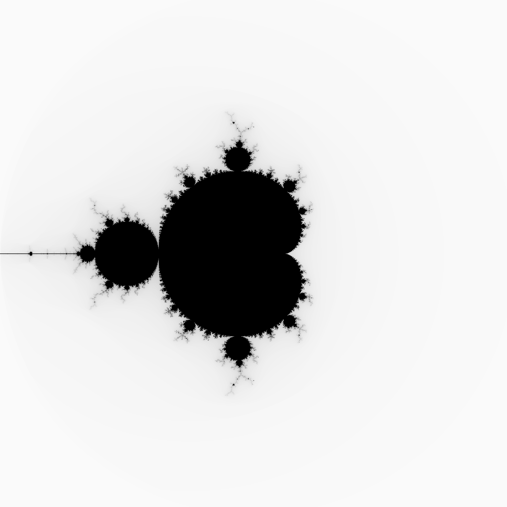

# juliagen - simple julia set generator

Commands:
```
-c : sets the inital condition c (default : -0.8 0.156)
usage : -c -0.8 0.156

-i : sets the number of iterations to perform (default : 100)
usage : -i 25

-s : sets smooth coloring as true (default : false)
usage : -s

-m : sets the mode to mandelbrot set, overrides -c (default : julia)
usage : -m
```

Example:

```
julia -s -m
```



```
julia -c 0.285 0.01 -i 50
```

