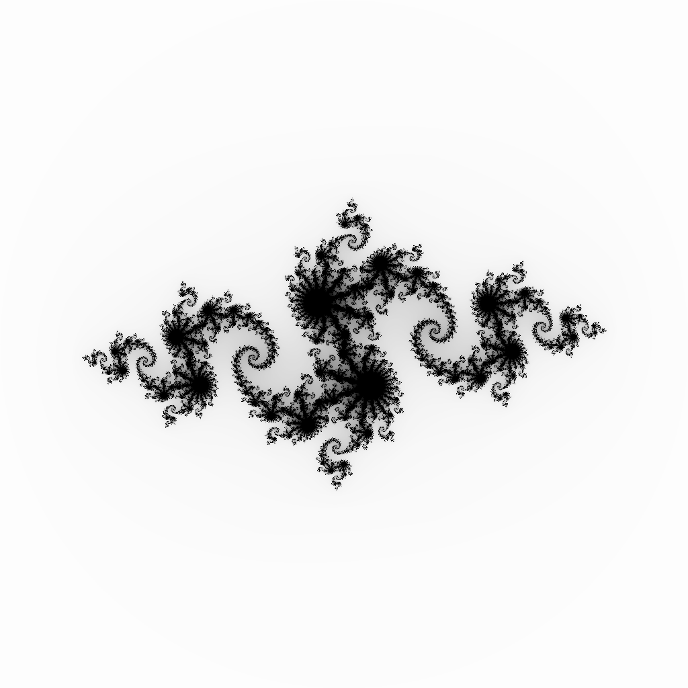

# juliagen - simple julia set generator

Commands:
```
-c : sets the inital condition c (default : -0.8 0.156)
usage : -c -0.8 0.156

-i : sets the number of iterations to perform (default : 100)
usage : -i 25

-s : sets the coloring algorithm to smooth (default : false)
usage : -s
```

Example:
```
julia -s -i 150
```

